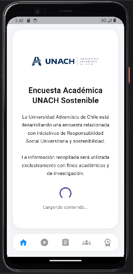
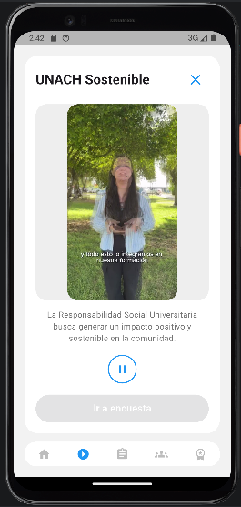
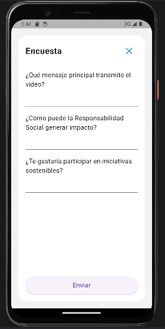
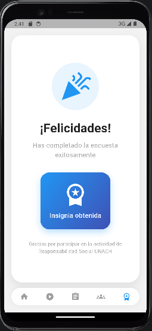

# Video del Jueves - VCM

## Descripcion del proyecto
Aplicacion movil en Flutter para la asignatura Desarrollo Movil Multiplataforma. Permite visualizar un video, responder una encuesta y guardar datos en Firebase Firestore junto con informacion del dispositivo.

## Objetivo
Desarrollar una app que integre video, encuesta y almacenamiento en Firebase.

## Funcionalidades

### Pantalla de inicio
- Presentacion del proyecto
- Logo institucional
- Navegacion principal

### Pantalla de video
- Reproduccion de video VCM
- Carga automatica despues de 10 segundos
- Controles play y pause
- Boton de encuesta habilitado al finalizar el video

### Pantalla de encuesta
Preguntas:
- ¿Qué mensaje principal transmite el video?
- ¿Cómo puede la Responsabilidad Social generar impacto?
- ¿Te gustaría participar en iniciativas sostenibles?

Datos almacenados en Firebase:
- Respuestas del usuario
- Modelo del dispositivo
- Sistema operativo
- Fecha y hora

### Pantalla final
- Mensaje de felicitacion
- Insignia del dia jueves
- Elementos motivacionales

## Tecnologias utilizadas
- Flutter
- Firebase Core
- Cloud Firestore
- video_player
- device_info_plus
- flutter_svg

## Instalación y ejecución

### 1. Clonar el repositorio
git clone https://github.com/JosefaPinilla/VideoJueves

### 2. Ingresar al proyecto
cd video_jueves

### 3. Instalar dependencias
flutter pub get

### 4. Configurar Firebase
Agregar google-services.json en android/app/
Verificar configuración en firebase_core
Asegurar que Firestore esté habilitado

### 5. Ejecutar la aplicación 
flutter run

Al correr la app, estas ser´n las vistas
### Inicio

### Video

### Encuesta

### Pantalla final
